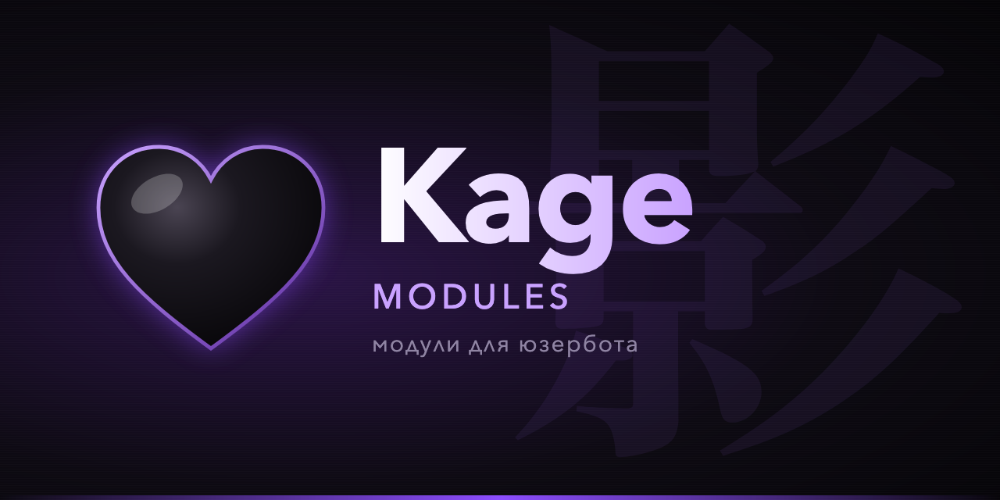
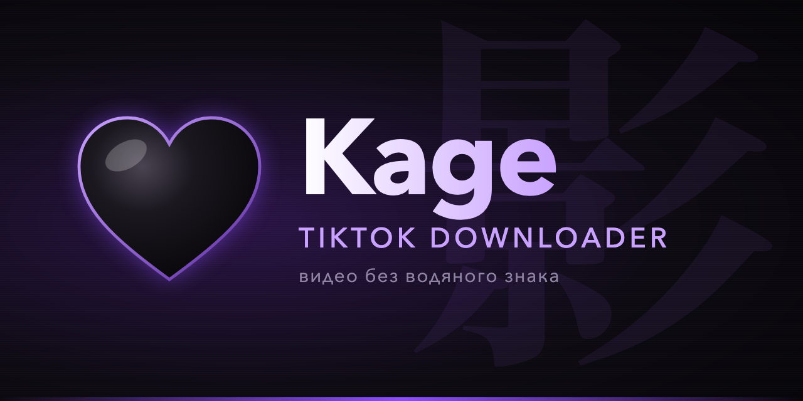

<div align="center">
  
  <h1>🖤 Kage Modules</h1>
  <p>Модули для юзербота <a href="https://github.com/gerdaroot/Kage">Kage</a>: подключаются одной командой, код открыт и проверен</p>

  <p>
    
    
    
    
  </p>
</div>

---

## 🚀 Быстрый старт

Подключи репозиторий один раз, дальше модули ставятся по имени:

```
.addrepo https://raw.githubusercontent.com/gerdaroot/kage-modules/main
.dlm tiktok
```

Или поставь конкретный модуль по прямой ссылке:

```
.dlm https://raw.githubusercontent.com/gerdaroot/kage-modules/main/tiktok.py
```

Зависимости модулей (например, `yt-dlp`) Kage ставит сам при загрузке.

---

## 📦 Модули

| Модуль | Что делает | Команды |
|---|---|---|
| [**TikTok**](#-tiktok) | Скачивает видео из TikTok без водяного знака и звук из них | `.tt` `.tiktok` `.tta` |
| [**Hentai**](#-hentai) | Случайные аниме-арты 18+ и SFW-вайфу с waifu.im, под спойлером | `.hentai` `.waifu` |

---

### 🎵 TikTok



Скачивает видео из TikTok **без водяного знака** и отправляет их прямо в чат: с обложкой, длительностью и
плеером Telegram. Может вытащить из видео только звук.

**Команды**

| Команда | Описание |
|---|---|
| `.tt <ссылка>` / `.tiktok <ссылка>` | Скачать видео. Можно ответить командой на сообщение со ссылкой |
| `.tta <ссылка>` | Скачать звук в исходном качестве TikTok (обычно mp3 128 кбит/с), с названием трека и автором |

**Под видео** — автор, описание и статистика: 👁 просмотры, ❤️ лайки, 💬 комментарии, ссылка на оригинал.

**Настройки** (`.config TikTok`)

| Параметр | По умолчанию | Описание |
|---|---|---|
| `max_size_mb` | `200` | Максимальный размер файла, МБ |
| `caption` | `true` | Подпись с автором, описанием и статистикой |
| `auto_download` | `false` | Автоматически скачивать видео, когда ты отправляешь сообщение, в котором только ссылка на TikTok |

**Как это работает.** Видео скачивается через [yt-dlp](https://github.com/yt-dlp/yt-dlp) прямо на твоём
сервере: ссылки не уходят сторонним сайтам-«скачивалкам». Выбирается поток H.264 со звуком — он
воспроизводится во всех клиентах Telegram. Обложку делает ffmpeg (в Docker-образе Kage он уже есть).

**Ограничения**
- Фото-посты (слайдшоу) пока не поддерживаются — только видео.
- Приватные видео и видео, закрытые для твоей страны, скачать нельзя.
- Звук внутри самих видео TikTok хранит в 64 кбит/с — это их ограничение. `.tta` берёт отдельный оригинальный
  трек (обычно 128 кбит/с) и отправляет его без перекодирования.
- Для обложек нужен ffmpeg. Без него видео всё равно скачается, просто без обложки.

---

### 🔞 Hentai

Случайные аниме-арты **18+** и SFW-вайфу с [waifu.im](https://waifu.im) — у каждой картинки есть автор и ссылка на
оригинал. Картинки приходят **под спойлером**.

| Команда | Описание |
|---|---|
| `.hentai [тег]` | Арт 18+. Теги: hentai (по умолчанию), ero, ecchi, oppai, milf, ass, paizuri, oral, maid |
| `.waifu [тег]` | SFW-вайфу: waifu, maid, uniform, selfies, персонажи Genshin и др. |
| `.hentai tags` | Список тегов |

**Настройки** (`.config Hentai`): `spoiler` — отправлять под спойлером (по умолчанию включено).

**Защита.** Персонажи, несовершеннолетние по канону, исключаются из NSFW на стороне API, и каждая полученная
картинка дополнительно проверяется по тегам. Школьная форма (`uniform`) есть только в SFW.

---
## 🌐 Модули сообщества

48 модулей из наборов Heroku и каталога coddrago, **проверенных и доработанных под Kage**: исправлены падения и
устаревшие API, закрыты дыры безопасности, убран мёртвый код. Названия и команды остались прежними.

```
.dlm <имя>        например: .dlm speedtest
```

| Модуль | Что делает | Команды | Автор | Лицензия |
|---|---|---|---|---|
| **Activists** | Ищет наиболее активных пользователей чата | `.activists` | @hikarimods | AGPL-3.0 |
| **AnimatedQuotes** | Простенький модуль, который создает анимированные стикеры | `.aniq` | @hikarimods | AGPL-3.0 |
| **Ascii_Face** | Random Ascii Face from utils | `.ascii` | @codrago_m | AGPL-3.0 |
| **AutoShortener** | Автоматически сокращает ссылки в твоих сообщениях, если они длиннее значения в конфиге | `.autosurl` `.surl` | @hikarimods | AGPL-3.0 |
| **Avatars** | Module for flexible profile avatar management | `.getava` `.delavas` `.setava` `.gifava` `.stopava` | @codrago_m | AGPL-3.0 |
| **BanStickers** | Bans stickerpacks, stickers and gifs in chat | `.banstick` `.banpack` `.unbanstick` `.unbanpack` `.unbanall` `.bananim` `.unbananim` | @hikarimods | AGPL-3.0 |
| **Complements** | Модуль который дарит комплементы девушке/парню | `.cg` `.cb` | @hikkaftgmods | AGPL-3.0 |
| **CUploader** | Заливает файл/медиа из реплая на выбранный файлхостинг | `.x0` `.x0at` `.kappa` `.tmpfiles` `.uguu` `.quax` `.pixeldrain` `.gofile` `.filebin` `.imgbb` | @codrago_m | AGPL-3.0 |
| **DelMessTools** | Module to manage and delete your messages in the current chat | `.purge` `.purgekeyword` `.purgetime` `.purgelength` `.nopurge` | @codrago_m | AGPL-3.0 |
| **EmojiDownload** | Download emoji from reply | `.emojidown` | @codrago_m | AGPL-3.0 |
| **Figlet** | Tool for work with figlet | `.figlet` `.figlist` | @codrago_m | AGPL-3.0 |
| **GuestBotCleaner** | Deletes messages from guest bots — bots that are not members of the chat | `.guestbotcleaner` | @codrago_m | AGPL-3.0 |
| **HttpStatusCodes** | Словарь HTTP-кодов | `.httpsc` `.httpscs` | @hikarimods | AGPL-3.0 |
| **ID** | ID of all! | `.userid` `.id` `.chatid` | @codrago_m | AGPL-3.0 |
| **Img2Pdf** | Packs images to pdf | `.img2pdf` | @hikarimods | AGPL-3.0 |
| **Inactive** | Blocks people who are inactive for a long time. Check .config | `.inactive` | @hikarimods | AGPL-3.0 |
| **InlineGhoul** | Неспамящий модуль Гуль | `.ghoul` | @hikarimods | AGPL-3.0 |
| **InstSave** | Download video from instagram without watermark | `.instas` | @hikamorumods | AGPL-3.0 / GPL-3.0 |
| **IrisLab** | Показывает лаб/жертв. Возможны задержки на получение инф-ции | `.lab` `.victims` `.upg` `.g` `.sv` `.d` `.notes` `.ic` `.list` | @hikkaftgmods | AGPL-3.0 |
| **Keyword** | Создавай кастомные кейворды с регулярными выражениями и командами | `.kword` `.kwords` `.kwbl` `.kwbllist` | @hikarimods | AGPL-3.0 |
| **LaTeX** | Renders mathematical formulas in LaTeX pngs | `.latex` | @hikarimods | AGPL-3.0 |
| **LoveMagic** | Известная TikTok анимация сердечек без спама в логи и флудвейтов | `.ilyi` `.ily` `.ilygayi` `.ilygay` | @hikarimods | AGPL-3.0 |
| **MentionsTagger** | Module for monitoring and logging keyword trigger mentions across chats | `.tagger` | @codrago_m, @zetgo | AGPL-3.0 |
| **MindGame** | Train your brain and mind | `.mindgame` | @hikarimods | AGPL-3.0 |
| **ModList** | Модуль для быстрого доступа к каналам с модулями | `.modlist` `.offmodlist` `.addmchat` | @codrago_m | AGPL-3.0 |
| **MoonLove** | Анимация с лунами и сердечками для любимой | `.moonlove` `.moonlovei` | @hikarimods | AGPL-3.0 |
| **PassGen** | Generate password | `.pass` `.passg` | @codrago_m | AGPL-3.0 |
| **PinterestDownloader** | Gives a link to download a file from Pinterest | `.pinterest` | @codrago_m | AGPL-3.0 |
| **PMBan** | Ban in pm for time | `.pmban` `.pmunban` | @codrago_m, @exttasy1 | AGPL-3.0 |
| **PollPlot** | Визуализирует опросы в виде графиков | `.plot` | @hikarimods | AGPL-3.0 |
| **PremiumStickers** | Sends premium stickers for free | `.premstick` | @hikarimods | AGPL-3.0 |
| **Quotes** | Quote messages as stickers via LyoSU quote-api | `.quote` `.fquote` | — | AGPL-3.0 / GPL-3.0 |
| **Randomizer** | Random - it's life! | `.chance` `.random` `.ship` `.randuser` | @codrago_m | AGPL-3.0 |
| **Scrolller** | Отправляет изображения с scrolller.com в виде инлайн галереи | `.gallery` `.gallerycat` | @hikarimods | AGPL-3.0 |
| **Send** | \| module to send messages | `.send` `.sendsm` | @codrago_m | AGPL-3.0 |
| **SkyBlockHelper** | Hypixel SkyBlock suite: Bazaar, Auctions, Items, Events, Elections, Kat & Calculations | `.bz` `.bztrack` `.bzuntrack` `.mayor` `.sbitem` `.sbevents` `.sbfiresale` `.sbah` `.sbkat` `.sbexp` | @codrago_m | AGPL-3.0 |
| **SoundGif** | Превращает видео в компактные Telegram-анимации со звуком. | `.soundgif` | @codrago_m | AGPL-3.0 |
| **SpeedTest** | Module to run speedtest using speedtest library | `.speedtest` | @codrago_m | AGPL-3.0 |
| **StickerToEmoji** | Converts stickers and sticker packs (static, TGS, and WEBM) into custom Telegram emoji packs via Telegram API. | `.s2e` `.s1e` | @codrago_m | AGPL-3.0 |
| **Swmute** | Удаляет сообщения от выбранных пользователей | `.swmute` `.swunmute` `.swmutelist` `.swmuteclear` | @nalinormods | GPL-3.0 |
| **TicTacToe** | Сыграй в крестики-нолики прямо в Телеграм | `.tictactoe` `.tictacai` | @hikarimods | AGPL-3.0 |
| **TmpChats** | Создает временные чаты во избежание мусорки в Телеграме. | `.tmpchat` `.tmpcurrent` `.tmpchats` `.tmpcancel` `.tmpctime` | @hikarimods | CC BY-NC-ND 4.0 |
| **TrashGuy** | Animation of trashguy taking out the trash | `.tguyi` `.tguy` | @hikarimods | AGPL-3.0 |
| **TruthOrDare** | Truth or dare? Play your favorite game from inside the Telegram (en/ru) | `.tod` `.todi` `.todlang` | @hikarimods | AGPL-3.0 |
| **Uploader** | Загружает файлы на различные хостинги | `.imgur` `.oxo` | @hikarimods | AGPL-3.0 |
| **VoiceToText** | Расшифровывает голосовые/видеосообщения в текст через бесплатные API (Google STT / Groq Whisper / Deepgram / Mistral) | `.v2t` `.v2tauto` `.v2tlist` `.v2tkey` | @codrago_m | AGPL-3.0 |
| **Web2file** | Скачивает содержимое ссылки и отправляет в виде файла | `.web2file` | @hikarimods | AGPL-3.0 |
| **YT-Preview** | Скачивает превью с ютуба | `.ytp` | @AstroModules | AGPL-3.0 |

<details>
<summary><b>Что проверялось и что не вошло</b></summary>

**Каждый модуль проверен** на утечку сессии, выполнение чужого кода, скрытые вступления в каналы, спам и доступ
посторонних к твоему аккаунту. Что нашлось и исправлено:
- `img2pdf`, `httpsc`, `instsave`, `quotes` — посторонние люди могли заставить твой аккаунт скачивать файлы или
  отправлять сообщения (`unrestricted`/`group_member`). Теперь команды работают только от владельца;
- `swmute` — при каждом запуске тайно вступал в канал автора;
- `uploader` — команда `.skynet` отправляла файлы на домен, который теперь занят казино;
- `inactive` — мог выгнать из чата тебя самого и админов;
- `pinterest`, `quotes`, `surl`, `scrolller`, `truth_or_dare` — переведены на живые API вместо умерших.

**Не вошли:**
- модули без лицензии, разрешающей публикацию ("Not licensed", без лицензии или с неясной) — они по-прежнему доступны у авторов;
- `promoclaimer` — автоматически слал сообщения боту с твоего аккаунта на каждую промо-ссылку в любом чате;
- `artai` — его сервис не работает с 2022 года;
- `DoxTool` (деанон), `loli` и `hentai` из каталога coddrago (контент с несовершеннолетними);
- дубли: второй `Compliments` (конфликтовал по команде `.cg`).

**Лицензии.** Модули сообщества распространяются под их исходными лицензиями (AGPL-3.0 / GPL-3.0): шапки авторов
сохранены, изменённые файлы помечены строкой `Modified for Kage`. `temp_chat` (CC BY-NC-ND 4.0) лежит без изменений —
его лицензия запрещает правки.
</details>

---

## 🧩 Совместимость

Модули написаны для **Kage** и работают в **Heroku**: у них общий API модулей. Минимальная версия указана
в начале каждого файла строкой `# scope: heroku_min …`.

---

## 🛠 Как устроен репозиторий

```
kage-modules/
├── full.txt        список модулей для .addrepo (по одному имени без .py на строку)
├── tiktok.py       свои модули (MIT)
├── hentai.py
├── community/      модули сообщества под исходными лицензиями
└── assets/         баннеры для README и превью в .help
```

Чтобы добавить модуль: положи `<имя>.py` в корень, допиши `<имя>` в `full.txt`, добавь строку в таблицу
модулей выше. Служебные строки в начале файла Kage читает сам:

```python
# meta developer: @gerdacod                 автор в .help и после загрузки
# meta banner: https://…/assets/<имя>.png   превью модуля
# scope: heroku_min 2.0.0                   минимальная версия API
# requires: yt-dlp                          pip-зависимости, ставятся при загрузке
```

---

## ⚠️ Безопасность

Модуль — это код с полным доступом к аккаунту. Все модули здесь с открытым кодом. Прочитай файл перед
установкой, особенно если ставишь модули из других репозиториев.

---

## 📜 Лицензия

Свои модули (`tiktok`, `hentai`) — [MIT](LICENSE) © [gerdaroot](https://github.com/gerdaroot).
Модули в `community/` — под лицензиями их авторов, указанными в начале каждого файла.
